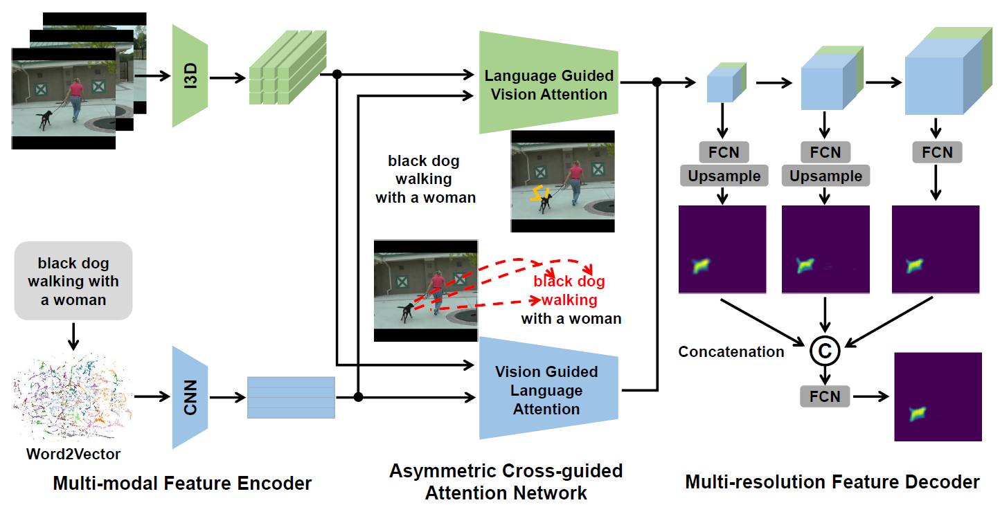

Code for the following paper (ICCV19 ACGA)

Hao Wang, *Cheng Deng**, Junchi Yan, Dacheng Tao. 
"Asymmetric Cross-Guided Attention Network for Actor and Action Video Segmentation From Natural Language Query", 
ICCV, 2019. [[pdf](upload/acga.pdf)]

## Introduction
Actor and action video segmentation from natural language query aims to selectively segment the actor and its
action in a video based on an input textual description. Previous works mostly focus on learning simple correlation between
two heterogeneous features of vision and language via dynamic convolution or fully convolutional classification.
However, they ignore the linguistic variation of natural language query and have difficulty in modeling global
visual context, which leads to unsatisfactory segmentation performance. To address these issues, we propose an asymmetric
cross-guided attention network for actor and action video segmentation from natural language query. Specifically,
we frame an asymmetric cross-guided attention network, which consists of vision guided language attention to
reduce the linguistic variation of input query and language guided vision attention to incorporate query-focused global
visual context simultaneously. Moreover, we adopt multiresolution fusion scheme and weighted loss for foreground
and background pixels to obtain further performance improvement. Extensive experiments on Actor-Action Dataset
Sentences and J-HMDB Sentences show that our proposed approach notably outperforms state-of-the-art methods.

  

## Run
Environment: Python 3.8.2, Pytorch 1.4.0, CUDA 10.1, 1 GPU (>11GB), RAM (>160GB), ROM (>200GB)

Data:  
A2D extracted feature ([BaiduNetDisk 163GB](https://pan.baidu.com/s/1WNfPp7t7YAO5MnSnaABTPQ), [OneDrive 163GB](https://stuxidianeducn-my.sharepoint.com/:f:/g/personal/hwang_3_stu_xidian_edu_cn/Ev56vhmmNqhHqwgJJeorcSABc-A95f3JHFR8_ZXYhjmw3Q?e=IIPZj4), passwd: abzr), Split ([BaiduNetDisk](https://pan.baidu.com/s/1-kAHSzWaHGvkb9vnbDelaA), [OneDrive](https://stuxidianeducn-my.sharepoint.com/:f:/g/personal/hwang_3_stu_xidian_edu_cn/EtdH0PVI_y5Hi1r2jChFZaIBF06C0oNyo9-uqVEMis3xlA?e=BRjvj4) passwd: 8ehb)     
JHMDB extracted feature ([BaiduNetDisk 23GB](https://pan.baidu.com/s/1C6_iXsKLcd-Fpa3-ZtZ9gg), [OneDrive 23GB](https://stuxidianeducn-my.sharepoint.com/:f:/g/personal/hwang_3_stu_xidian_edu_cn/EucY9-MpDkVAoXeu_obhGdIBUBw0bdVLPWbwgq9KMqUgOA?e=Eq9s9c), passwd: d7vw), Split ([BaiduNetDisk](https://pan.baidu.com/s/182paqmm01KDjVHobAtGwtw), [OneDrive](https://stuxidianeducn-my.sharepoint.com/:f:/g/personal/hwang_3_stu_xidian_edu_cn/EhEdxyFytXxNqXNzL7D3VT8BzU8_bx0eGmOymvqLciLoHA?e=qKRBgG) passed: p0ak)    
pretrained model ([BaiduNetDisk 666MB](https://pan.baidu.com/s/1rVMa3KxQapSR34sScgUEkg), [OneDrive 666MB](https://stuxidianeducn-my.sharepoint.com/:u:/g/personal/hwang_3_stu_xidian_edu_cn/ESxq4fMVUOtGoTAXp_RoYBQBgdNYicTyqH_M6MsNkFLtNQ?e=GlObU2), passwd: jtzu)
```bash
cat a2d_data.tara* >> a2d_data.tar
tar xvf a2d_data.tar -C dataset/A2D/preprocessed/
cat jhmdb_data.tara* >> jhmdb_data.tar
tar xvf jhmdb_data.tar -C dataset/JHMDB/preprocessed/
tar xvf ckpt.tar -C checkpoint/ACGA/
```

Testing
```bash
CUDA_VISIBLE_DEVICES=0 PYTHONPATH=`pwd` <Your Python Path> main.py --dataset A2D --testing
```
```bash
CUDA_VISIBLE_DEVICES=0 PYTHONPATH=`pwd` <Your Python Path> main.py --dataset JHMDB --testing
```
Results (**Note: slightly different with the paper after we clean and refactor the code**)

A2D

|    Method    |    P@0.5    |    P@0.6    |    P@0.7    |    P@0.8    |    P@0.9    |    mAP@0.5:0.95    |    Overall IoU    |    Mean IoU    |
|:-----------:|:-----------:|:-----------:|:-----------:|:-----------:|:-----------:|:-----------:|:-----------:|:-----------:|
| Hu et al.  |   34.8     |    23.6     |     13.3    |      3.3    |      0.1    |      13.2    |     47.4    |     35.0   |
| Li et al.  |   38.7     |    29.0     |     17.5    |      6.6    |      0.1    |      16.3    |     51.5    |     35.4   |
| Gavrilyuk et al.|   47.5     |    34.7     |     21.1    |      8.0    |      0.2    |      19.8    |     53.6    |     42.1   |
| ACGA (ours)  |   56.7     |    47.6     |     33.8    |      16.9    |      1.9    |      28.5    |     61.3    |     49.8   |


JHMDB

|    Method    |    P@0.5    |    P@0.6    |    P@0.7    |    P@0.8    |    P@0.9    |    mAP@0.5:0.95    |    Overall IoU    |    Mean IoU    |
|:-----------:|:-----------:|:-----------:|:-----------:|:-----------:|:-----------:|:-----------:|:-----------:|:-----------:|
| Hu et al.  |   63.3     |    35.0     |     8.5    |      0.2    |      0.0    |      17.8    |     54.6    |     52.8   |
| Li et al.  |   57.8     |    33.5     |     10.3    |      0.6    |      0.0    |      17.3    |     52.9    |     49.1  |
| Gavrilyuk et al.|   69.9     |    46.0     |     17.3    |      1.4    |      0.0    |      23.3    |     54.1    |     54.2   |
| ACGA (ours)  |   75.4     |    58.5     |     29.4    |      3.6    |      0.0    |      29.3    |     57.8    |     58.8   |


Training from scratch
```bash
CUDA_VISIBLE_DEVICES=0 PYTHONPATH=`pwd` <Your Python Path> main.py --dataset A2D
```


## Reference

If you found this code useful, please cite the following paper:

    @inproceedings{wang2019asymmetric,
      title={Asymmetric Cross-Guided Attention Network for Actor and Action Video Segmentation From Natural Language Query},
      author={Wang, Hao and Deng, Cheng and Yan, Junchi and Tao, Dacheng},
      booktitle={Proceedings of the IEEE International Conference on Computer Vision},
      pages={3939--3948},
      year={2019}
    }
    @inproceedings{wang2020context,
      title={Context Modulated Dynamic Networks for Actor and Action Video Segmentation with Language Queries},
      author={Wang, Hao and Deng, Cheng and Ma, Fan and Yang, Yi},
      booktitle={AAAI},
      pages={12152--12159},
      year={2020}
    }
}

[Apache License 2.0](http://www.apache.org/licenses/LICENSE-2.0)
